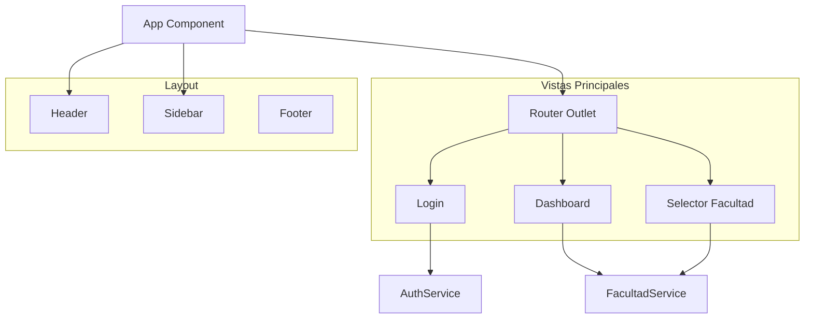

# Sistema de Chequera - Cliente Angular


Este es el cliente Angular para el sistema de chequera de la Universidad de Mendoza. La aplicación permite a los usuarios autenticarse con Google y consultar información detallada de sus chequeras académicas.

## 🚀 Funcionalidades

### Autenticación
- Login con Google OAuth 2.0
- Verificación de autorización en el backend
- Gestión de sesiones persistentes con localStorage

### Selección de Facultad
- Lista de facultades disponibles para el usuario
- Selección dinámica de facultad

### Consulta de Chequera
- Ingreso de número de documento
- Consulta de estado de chequera por facultad
- Visualización completa de información académica

### Información Mostrada
- **Datos Personales**: Nombre, apellido, documento
- **Información Académica**: Facultad, lectivo actual
- **Contacto**: Emails personal e institucional
- **Series de Chequera**: Detalles completos de cada serie
- **Cuotas**: Estado de pagos, vencimientos, importes
- **Pagos Realizados**: Historial de transacciones
- **MercadoPago**: Enlaces directos para pagos pendientes

## 📜 Changelog

Para ver un historial detallado de los cambios, consulta el archivo [CHANGELOG.md](CHANGELOG.md).

## 🛠️ Tecnologías Utilizadas

- **Angular 21.0.0** - Framework principal
- **TypeScript 5.9.3** - Lenguaje de programación
- **Tailwind CSS 3.4** - Framework de estilos utilitarios
- **SCSS** - Preprocesador CSS (para configuraciones globales)
- **RxJS 7.8.0** - Programación reactiva
- **Google Identity Services** - Autenticación OAuth
- **Docker** - Contenerización
- **Nginx** - Servidor web para producción

## 📋 Requisitos Previos

- Node.js (versión 18 o superior)
- npm
- Docker (opcional, para ejecución en contenedores)
- Backend del sistema corriendo en `http://127.0.0.1:8121`

## 🔧 Instalación y Configuración

### 1. Clonar el repositorio
```bash
git clone <url-del-repositorio>
cd um.tesoreria.chequera-client
```

### 2. Instalar dependencias
```bash
npm install
```

### 3. Configurar variables de entorno

La configuración de la aplicación se gestiona a través de variables de entorno, que son utilizadas para generar los archivos `environment.ts` correspondientes.

Para desarrollo local, puedes crear un archivo `.env` en la raíz del proyecto con el siguiente contenido:
```
GOOGLE_CLIENT_ID=TU_GOOGLE_CLIENT_ID_AQUI
BACKEND_URL=http://127.0.0.1:8121
```

Luego, ejecuta el script para generar el archivo de configuración de desarrollo:
```bash
npm run generate-env
```
Esto creará `src/environments/environment.development.ts` con los valores del archivo `.env`.

Para producción, las variables de entorno se deben configurar directamente en el entorno de despliegue (por ejemplo, en el `Dockerfile` o en el servicio de hosting).

### 4. Configurar Google OAuth

1. Ve a [Google Cloud Console](https://console.cloud.google.com/)
2. Crea un nuevo proyecto o selecciona uno existente
3. Habilita la API de Google Identity Services
4. Crea credenciales OAuth 2.0
5. Configura los orígenes autorizados:
   - `http://localhost:4200` (desarrollo)
   - `https://tu-dominio.com` (producción)
6. Copia el Client ID y úsalo en tu archivo `.env` o en las variables de entorno de producción.

## 🚀 Ejecutar la Aplicación (Localmente)

```bash
npm start
```
La aplicación estará disponible en `http://localhost:4200`.

## 🐳 Ejecutar con Docker

El proyecto incluye archivos `Dockerfile` para facilitar la ejecución en contenedores.

### Desarrollo
Para levantar un contenedor en modo de desarrollo con hot-reload:
```bash
# Construir la imagen de desarrollo
docker build -t chequera-client-dev -f Dockerfile.local .

# Ejecutar el contenedor
docker run -p 4200:4200 -v $(pwd)/src:/app/src chequera-client-dev
```

### Producción
Para construir la imagen de producción y ejecutarla:
```bash
# Construir la imagen de producción
docker build -t chequera-client .

# Ejecutar el contenedor pasando las variables de entorno
docker run -p 80:80 \
  -e GOOGLE_CLIENT_ID="TU_GOOGLE_CLIENT_ID_DE_PRODUCCION" \
  -e BACKEND_URL="https://tu-backend.com" \
  chequera-client
```
La aplicación estará disponible en el puerto 80 del host.

## 📱 Uso de la Aplicación

### 1. Login
- Accede a la aplicación
- Haz clic en "Iniciar sesión con Google"
- Autoriza la aplicación con tu cuenta de Google

### 2. Selección de Facultad
- Se mostrarán las facultades disponibles para tu usuario
- Selecciona la facultad deseada

### 3. Consulta de Chequera
- Ingresa tu número de documento
- Haz clic en "Consultar Chequera"
- Revisa la información detallada mostrada

### 4. Información Disponible
- **Estado de cuotas**: Pagadas o pendientes
- **Vencimientos**: Fechas y montos de cada vencimiento
- **Pagos realizados**: Historial completo de transacciones
- **Enlaces de pago**: Acceso directo a MercadoPago para cuotas pendientes

## 🎨 Características de Diseño

- **Diseño Responsivo**: Adaptable a diferentes tamaños de pantalla
- **Interfaz Moderna**: Gradientes, sombras y animaciones suaves
- **UX Optimizada**: Estados de carga, errores y feedback visual
- **Accesibilidad**: Contraste adecuado y navegación por teclado

## 🔒 Seguridad

- Autenticación OAuth 2.0 con Google
- Verificación de autorización en el backend
- Validación de datos en el frontend
- Manejo seguro de tokens y sesiones

## 🐛 Solución de Problemas

### Error de CORS
Asegúrate de que el backend esté configurado para aceptar peticiones desde el origen de tu frontend.

### Error de Google OAuth
Verifica que el Client ID esté correctamente configurado y que los orígenes autorizados en Google Cloud Console coincidan con el dominio desde el que accedes.

### Error de Conexión al Backend
Confirma que el backend esté corriendo y que la `BACKEND_URL` sea correcta.

## 🏗️ Arquitectura de Componentes



## 📝 Estructura del Proyecto

```
src/
├── app/
│   ├── components/
│   │   ├── login/           # Componente de autenticación
│   │   ├── facultad-selector/ # Selector de facultad y consulta
│   │   ├── dashboard/       # Dashboard principal
│   │   ├── sidebar/         # Barra lateral de navegación
│   │   ├── header/          # Encabezado de la aplicación
│   │   └── footer/          # Pie de página
│   ├── services/
│   │   ├── auth.service.ts  # Servicio de autenticación
│   │   ├── backend.service.ts # Servicio de comunicación con backend
│   │   └── facultad.service.ts # Servicio de gestión de facultades
│   ├── models/
│   │   └── usuario.interface.ts # Interfaces de datos
│   ├── guards/
│   │   └── auth.guard.ts    # Guard de autenticación
│   └── config/
│       └── app.config.ts    # Configuración de la aplicación
├── environments/
│   ├── environment.ts
│   └── environment.development.ts
└── styles.scss              # Estilos globales
```

## 🤝 Contribución

1. Fork el proyecto
2. Crea una rama para tu feature (`git checkout -b feature/AmazingFeature`)
3. Commit tus cambios (`git commit -m 'Add some AmazingFeature'`)
4. Push a la rama (`git push origin feature/AmazingFeature`)
5. Abre un Pull Request

## 📄 Licencia

Este proyecto está bajo la Licencia MIT. Ver el archivo `LICENSE` para más detalles.

## 📞 Soporte

Para soporte técnico o preguntas sobre la implementación, contacta al equipo de desarrollo.
